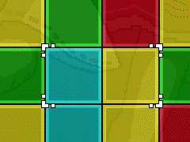

Panel de Touhou is a 'Tile-Matching' puzzle game inspired by the Panel de Pon series. The goal of this project is to create a spiritual successor to the Panel de Pon series with updated gameplay mechanics, modern features such as netplay and leaderboards, and use the Touhou Project series as the aesthetic basis for the game.

- Gameplay Mechanics

Swapping:
By pressing the 'swap' key, you can swap the 2 panels inside of the selector.

